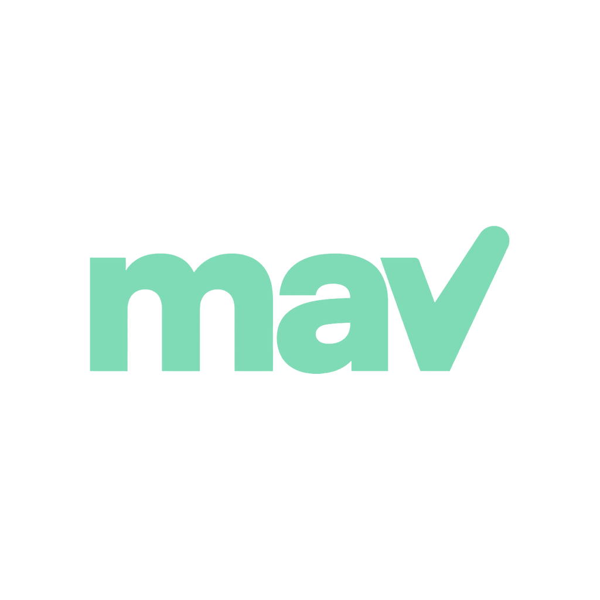
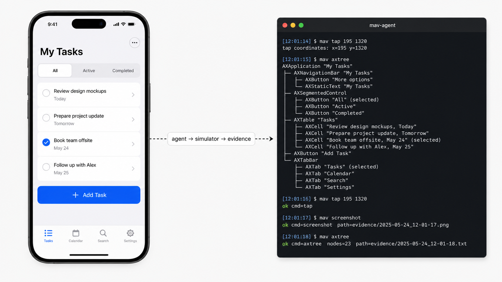
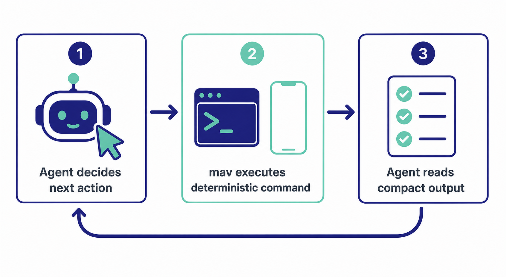
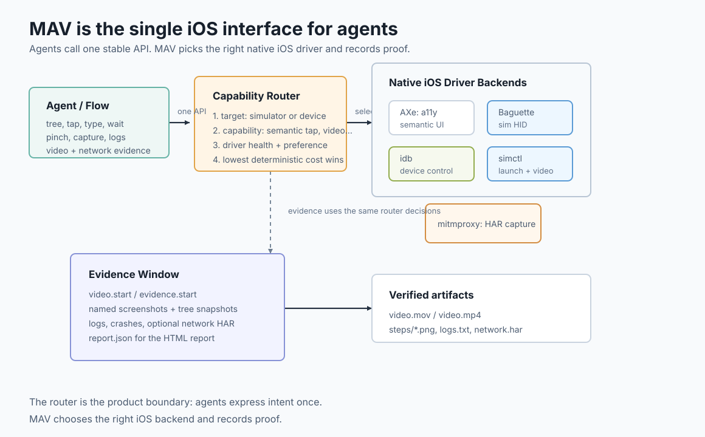

<p align="left">
  
</p>

# MAV

[](https://github.com/bitomule/mav/actions/workflows/ci.yml)
[](https://github.com/bitomule/mav/releases)
[](LICENSE)

The iOS and macOS control plane for AI coding agents: one command surface, native
drivers underneath, and evidence your agent can hand back to a human.

<p align="center">
  
</p>

Mobile Agent Verifier (`mav`) is the interface between an agent and Apple platforms:
iOS simulators, physical devices, and macOS apps. The
agent asks for intent-level operations like `ui tree`, `tap`, `pinch`,
`network start`, or `evidence report`; MAV routes each operation to the best
native backend available on that target, records what happened, and returns a
compact result the next turn can act on.

MAV is intentionally not an autonomous testing agent. It runs the command. The agent decides what to run next.

## Why MAV?

MAV gives agents one stable API over the messy Apple toolchain. Agents ask for a
capability; MAV picks the driver for the selected simulator or device and
returns compact output the next turn can parse:

- Accessibility tree, semantic taps, waits, and screenshots go through AXe when
  it is healthy.
- Simulator multitouch, system UI, hardware buttons, erase, and hideKeyboard go
  through Baguette.
- Physical device install, launch, coordinate input, logs, screenshots, and
  crashes go through idb.
- Simulator crash checks read local DiagnosticReports directly.
- Simulator lifecycle, video, and logs go through simctl.
- Simulator and macOS network evidence goes through mitmproxy HAR capture.
- macOS accessibility tree, window capture, taps, and typing go through cua-driver;
  axcli delivers input to accessory windows cua-driver cannot resolve.
- macOS lifecycle, video, logs, and crashes go through the system: `screencapture`,
  `log stream`, and the same `.ips` crash format iOS uses.

Runs can record accepted video, named screenshots, accessibility tree snapshots,
log tails, crash reports, command trails, and optional HAR network traffic.
`mav evidence report` writes a verified manifest for those artifacts; the MAV
skill turns the manifest into a visual HTML report for humans.

Native MAV YAML flows compose setup, UI actions, waits, assertions, logs,
crashes, network capture, and report generation without hiding the underlying
command trail.

MAV uses a project-local launch recipe to build, locate, install, and launch
the app. Bazel, Xcode, Tuist, Make, Just, and project scripts are setup-time
templates only; runtime executes the configured recipe.

## How an agent uses MAV

<p align="center">
  
</p>

Each call is one verb. The agent picks the next verb based on the previous
output. The commands that cover most flows are `mav ui tree`, `mav ui tap`,
`mav capture`, and `mav logs`. Use `mav --help` and nested help such as
`mav ui tap --help` or `mav evidence report --help` for the full command
surface.

## Used at

`mav` runs in development on these production iOS apps:

- [Undolly](https://undolly.app) — finding duplicate photos
- [Boxy](https://boxy-app.com/) — organising physical items
- [HiddenFace](https://hiddenface.app) — privacy-first face blur

## Status

MAV is early and evolving. The current stable pieces are:

- Configurable project launch recipes.
- Setup-time detection for common project launch commands.
- Simulator selection, boot, install, launch, screenshot, and video.
- Physical device selection, install, launch, logs, screenshots, UI actions,
  crashes, and evidence screenshots.
- AXe-first accessibility tree inspection and semantic interactions.
- idb coordinate taps and device/simulator fallback capabilities.
- Baguette-backed multitouch gestures, system UI tree, hardware buttons, and
  keyboard helpers on simulator.
- Native MAV YAML flows through `mav run`.
- Verified evidence manifests in `.mav/runs/<run-id>/report.json`; the MAV
  skill authors the visual HTML report from that data.
- Filtered unified log capture for explicit MAV probes.
- macOS targets: launch, quit, openURL, clipboard, clear-state, accessibility tree,
  window capture, taps, and typing through cua-driver, with axcli as the
  accessory-window input hatch.
- macOS network capture through mitmproxy, with automatic system-proxy setup and
  restore, and VM-gated system-clock time travel.
- Platform profiles and named fixtures in `.mav/config.yaml`.



## Platforms

`mav` drives iOS simulators, physical iOS devices, and macOS apps. `target_kind` in
`.mav/config.yaml` picks one: `simulator`, `device` or `macos`.

## macOS

`target_kind: macos` is a first-class target. A macOS app has no UDID: its identity is
its bundle id plus the `.app` path the launch recipe resolves at runtime. Everything in
the core loop — `ui tree`, `ui tap`, `ui type`, `capture`, `logs`, `crashes`,
`evidence` — works. `ui swipe` translates to a scroll with the direction inverted, so a
flow written once means the same motion on both platforms. Multitouch gestures,
hardware buttons and `hideKeyboard` do not exist on macOS and return structured errors.

### Drivers

The canonical driver is [cua-driver](https://github.com/trycua/cua) (MIT). The reason
is structural, not preference: macOS grants Accessibility and Screen Recording **only
to interactive GUI processes**, so a CLI cannot hold them no matter how many times you
grant them to your terminal. The only architecture that works is a broker — an app that
owns the permissions, plus a socket — and cua-driver ships one: the binary mav invokes
lives inside `/Applications/CuaDriver.app`. It provides the accessibility tree with
geometry, window capture, and background input in one tool, and tree and capture come
out of the same call, so both describe the same instant.

mav starts the CuaDriver daemon itself when it is not running, with `open -g` so it
does not steal focus. Nobody has to know the launch command.

[axcli](https://github.com/andelf/axcli) stays installed as an escape hatch, input
only, for one case: cua-driver resolves the window through `list_windows`, and an app
whose entire UI lives in an accessory window — a floating panel, a HUD, a popover, a
SwiftUI onboarding — needs to be addressed by pid. axcli targets by `--app` and needs
no window id. When cua-driver hits this it fails with `no on-screen window for pid`,
which is not "the app is not open"; retry the interaction with `--prefer-driver axcli`.

Video and full-screen capture fall back to the system `screencapture`. A full-screen
shot is worse evidence than a window-scoped one, so it only wins when nothing better
can resolve the window.

### Putting a macOS app under control

```bash
mav setup --install cua-driver axcli
cua-driver permissions grant
mav doctor
mav --profile mac open
mav --profile mac ui tree
```

`mav setup --install cua-driver` runs the upstream install script
(`curl -fsSL https://cua.ai/driver/install.sh | bash`). `cua-driver permissions grant`
is the only tested flow that registers the app in the System Settings panes by itself;
every other tool has to be added by hand through the panel's "+". `mav doctor` reports
Accessibility and Screen Recording by asking the daemon — the process that actually
holds the permissions — not the process running `mav`, and answers `unknown` instead of
lying with your terminal's permissions when the daemon is down.

### Network capture

`mav network start` works end to end on macOS: it starts mitmproxy, sets the system
proxy itself with `networksetup` — no sudo — on the network service the default route
leaves through, and `mav network stop`, and `mav stop`, restore it. The previous proxy
state is saved in the run directory, because start and stop are separate invocations
and a run that dies must not leave the machine pointing at a dead proxy. Verified:
`GET https://example.com/ -> 200` decrypted in the HAR.

If the mitmproxy CA is not trusted, the command says so with the exact
`security add-trusted-cert` command in a `ca_next` field. Without that trust, HTTPS
comes out as CONNECT tunnels with no content: a capture that looks like it works and
proves nothing.

### Time and location

`mav time travel --to <RFC3339>` and `mav time reset` work on macOS. `freeze` and
`scale` do not: on macOS the clock is the **system's**, not the app's, and a system
clock runs — it cannot be stopped or accelerated. On iOS, simtime interposes the
clock the app sees; on macOS the only per-process route is libfaketime through
`DYLD_INSERT_LIBRARIES`, which the hardened runtime blocks in any app signed for
distribution. Because travel moves the whole machine's clock, it is closed by default
outside a VM (detected through `kern.hv_vmm_present`); pass `--system-clock` to force
it on a host on purpose.

Location cannot be faked on macOS, and knowing why saves an afternoon: Xcode's
"Simulate Location" is not a debugger feature — it travels over the DVT channel, which
serves iOS devices, and does nothing against a macOS app. lldb has no equivalent
command. The tools that exist fake a connected iPhone, not the Mac. CoreLocationCLI
only reads. What remains is private locationd API or disabling SIP, and mav takes
neither road.

### Profiles

An app that ships iOS and macOS variants from one repo usually shares the debug bundle
id between them, so the bundle id cannot tell them apart. **Profiles** are a
per-platform overlay on the flat config: a block that overrides `target_kind`,
`app_target`, `process_name`, `target_command`, the log fields, and the launch recipe.
Selection order is `--profile`, then `MAV_PROFILE`, then `default_profile`; a requested
profile that does not exist fails naming the valid ones instead of silently falling
back to the base. A repo with one platform writes no profiles and nothing changes.

```yaml
bundle_id: com.example.app
target_kind: simulator

launch:
  mode: custom
  commands:
    build: bazelisk build //App:ExampleiOS
    app_path: ./scripts/mav-app-path.sh
    install: xcrun simctl install "$MAV_UDID" "$MAV_APP_PATH"
    launch: xcrun simctl launch "$MAV_UDID" "$MAV_BUNDLE_ID"

profiles:
  mac:
    target_kind: macos
    app_target: "//App:ExampleMac"
    process_name: Example
    launch:
      commands:
        build: bazelisk build //App:ExampleMac
        app_path: ./scripts/mav-app-path-mac.sh
        install: ""
        launch: ""

fixtures:
  empty:
    - ./scripts/wipe-demo-data.sh
  seeded:
    - ./scripts/seed-demo-data.sh
```

An absent profile key inherits from the base; an explicit empty string annuls it, and
the distinction matters: `install: ""` and `launch: ""` are how the mac profile cancels
the inherited simctl commands. On macOS there is nothing to install — the app runs from
wherever it was built — and an empty launch routes to the driver, which executes
`Contents/MacOS/<binary>` directly because `open` does not propagate environment
variables, and the environment is how mav injects its configuration.

Profiles also accept `runner: local|crabbox`, which declares **where** the profile
runs. mav does not orchestrate machines; the full recipe for a disposable macOS VM,
with verified findings about TCC bootstrap, lives in
[`examples/macos-vm/`](examples/macos-vm/), and
`scripts/build-mav-vm-image.sh` builds a base VM image with mav, cua-driver, axcli,
and mitmproxy preinstalled.

### Fixtures

**Fixtures** are named states: lists of commands that leave the app in a known
situation before launch. mav does not know what a fixture does internally — it only
runs the commands — because how to seed is specific to each app. Pick one per run with
`--fixture <name>` on `mav open`, or `fixture:` on a flow's `open` step.

They run between the `install` and `launch` steps, and that placement is the point: it
is the only window where the app container already exists and nothing holds the app's
database open. mav quits a live instance from an earlier run before seeding, for the
same reason. Fixtures complement `launch.commands`, they do not replace them.
`--clear-state` composes: the container is wiped first, then the fixture seeds on top.
The applied fixture is recorded in the run's `report.json` — a run whose evidence does
not say which state it started from is not reproducible.

Fixtures work the same on iOS (the simulator's app container) and on macOS
(`~/Library/Containers/<bundle-id>/Data/`). `--fixture` is rejected together with
`--no-relaunch`, like `--clear-state` and for the same reason: `--no-relaunch` skips
the whole recipe, so the fixture would never run and the agent would validate against
data nobody seeded.

On macOS, `--clear-state` is the honest equivalent of an uninstall: it deletes the
app's container and preferences, not the app.

### What does not carry over from iOS

- cua-driver elements do **not** expose `AXIdentifier`. The `id` mav reports is the
  element's `element_token`, valid within the current snapshot — so `mav ui tap --id`
  on macOS does not have the across-runs stability that axe accessibility ids give on
  iOS. Read the tree first and target what it reports, or use `--text`.
- There is no menu-bar interaction and no window management: `mav` reads and drives an app's
  own UI, not the desktop around it.
- Running `mav` over SSH leaves it outside the Aqua session, where `screencapture`
  fails with `could not create image from display`. This is why the VM recipe needs
  the broker — see [`examples/macos-vm/`](examples/macos-vm/).

See the [macOS scope evaluation](docs/macos-scope-evaluation.md) for how this was
decided and what was deliberately left out.

## Requirements

- macOS.
- Xcode command line tools.
- Go, for development builds.
- AXe, for accessibility tree and semantic UI actions.
- idb, for coordinate taps and device/simulator fallback operations.
- Baguette, for simulator multitouch (pinch, two-finger pan), the
  SpringBoard / system UI tree, hardware buttons, keyboard erase, and
  hideKeyboard. Sim-only — device multitouch is intentionally unsupported.
- cua-driver, for macOS targets: accessibility tree, window capture, taps, and
  typing. Install with `mav setup --install cua-driver`.
- axcli, for macOS input into accessory windows that cua-driver's `list_windows`
  cannot see. Installed from `bitomule/tap/axcli`.
- mitmproxy, optional, for `mav network start|stop` HAR capture on the
  simulator and on macOS. Install with `mav setup --install mitmproxy`.

Check the local environment:

```bash
mav doctor
```

`mav doctor` reports capability availability. MAV routes commands by
capability: accessibility and semantic actions use AXe, coordinate taps and
device fallback use idb, multitouch and system UI use baguette on simulator.
Physical iOS devices require idb for install, launch, logs, screenshots, and
crashes. Simulator crash checks use local DiagnosticReports directly, avoiding
idb_companion crash-list parser failures from unrelated malformed reports.
Multitouch gestures, system-UI trees, and hideKeyboard return structured errors
on device — use a simulator for those flows.
On macOS targets, `mav doctor` reports Accessibility and Screen Recording by asking
the cua-driver daemon — the process that holds them — and the fix it prints is
`cua-driver permissions grant`.

Configure the project or install supported helper tools:

```bash
mav setup
```

`mav setup` is idempotent and interactive by default. It scaffolds or refreshes
`.mav/config.yaml` by detecting app identity, simulator defaults, UI tools, and
an editable launch recipe, then asks you to accept or replace each value.
Existing explicit choices in `.mav/config.yaml` are preserved. Use
`mav setup --non-interactive` for CI/scripts.

```bash
mav setup --install axe idb baguette
```

`mav setup --install idb` prefers pipx with Python 3.12/3.13 for `fb-idb` and
uses Homebrew for `idb-companion`. AXe and Baguette are installed via Homebrew
(`cameroncooke/axe/axe` and `tddworks/baguette/baguette`).
`mav setup --install cua-driver` runs the upstream install script
(`curl -fsSL https://cua.ai/driver/install.sh | bash`); the binary it installs lives
inside `/Applications/CuaDriver.app`. axcli comes from `bitomule/tap/axcli`.

## Install

With Homebrew:

```bash
brew install bitomule/tap/mav
```

Install the MAV skill globally with Vercel's Skills CLI:

```bash
mav install-skills
```

This runs:

```bash
npx skills add bitomule/mav --skill mav --global --yes
```

Build from source:

```bash
git clone https://github.com/bitomule/mav.git
cd mav
make build
```

Run the development binary:

```bash
.build/mav help
```

Or put it on your `PATH`:

```bash
ln -sf "$PWD/.build/mav" /usr/local/bin/mav
```

Release binaries are built by the GitHub release workflow for tagged releases.
Homebrew packaging lives in `packaging/homebrew/mav.rb` and is published to
`bitomule/tap`.

The release workflow can also update `bitomule/homebrew-tap` automatically. The
`bitomule/mav` repo must define a `COMMITTER_TOKEN` secret with permission to
push to `bitomule/homebrew-tap`; this is the same pattern used by Koubou.

## Quick Start

Run from the root of an iOS app repo:

```bash
mav setup
mav sim list
mav sim select --device "iPhone 17 Pro Max" --ios 26
mav open
mav ui tree
```

`mav setup` scaffolds `.mav/config.yaml`. By default it is interactive: MAV detects a bundle id, selected simulator, locale/language,
available tools, and a launch recipe when it can infer one, then lets you accept
or replace each value. Use `mav setup --non-interactive` for CI/scripts.
Launch recipe detection is intentionally conservative: MAV recognizes explicit
`Makefile`/`justfile` MAV targets, `scripts/mav-build` plus
`scripts/mav-app-path`, and standard Bazel/Tuist/Xcode project shapes.

`mav open` executes the configured launch recipe. It creates a persistent run
directory under `.mav/runs/<run-id>/` and starts `logs.txt` for MAV probes. Use
`mav open --clear-state` to uninstall the configured bundle before install and
launch. If a Bazel app bundle from `bazel-out` fails simulator install with a
permission error, MAV copies the `.app` into the run directory with writable
permissions and retries the install.

Use `mav open --no-relaunch` when the app was launched manually with custom
environment such as `SIMCTL_CHILD_*` and MAV should only attach run logging to
the app already in front.

Example compact output:

```text
ok cmd=setup bundle=com.example.app config=/repo/.mav/config.yaml launch_recipe=ok multitouch=missing multitouch_next="mav setup --install baguette"
ok cmd=open run=7fd logs=/repo/.mav/runs/7fd/logs.txt target="iPhone 17 Pro Max"
ok cmd=ui.tree driver=axe nodes=42 screen=unknown recognized_screen=settings screen_source=recognized
node index=1 id=settings_button label=Settings role=button enabled=true frame="{{20, 120}, {180, 44}}"
```

Use `--raw` only when the underlying tool output is needed:

```bash
mav --raw ui tree
```

## Help

```bash
mav --help
mav ui --help
mav ui tap --help
mav flow lint --help
mav evidence report --help
```

Help is intentionally hierarchical. The README explains the workflow; the CLI
owns the current command reference.

## Output Contract

Default output starts with one compact status line. Commands that inspect
structured state, such as `mav ui tree`, may add bounded detail lines after it:

```text
ok cmd=<command> key=value key=value
fail code=<error_code> key=value key=value
```

Examples:

```text
ok cmd=capture file=/tmp/mav/7fd/captures/20260503T120000.000.png run=7fd target_kind=simulator udid=E4C10E36-2C4E-4B2B-9C9C-1F4C6A9B7A11
ok cmd=logs file=/tmp/mav/7fd/logs.txt matches=1 run=7fd target_kind=simulator udid=E4C10E36-2C4E-4B2B-9C9C-1F4C6A9B7A11
fail code=ui_tree_empty driver=axe reason=simulator_accessibility_unavailable recovered=false
```

A `fail` line comes with exit status 1, and output is written even when the
command fails. Every command used to exit 0 regardless, so
`mav ui tap ... && next-step` chained past a failure; scripts and agents can
now branch on the exit code instead of parsing stdout.

Commands that acted on a simulator or device add `udid`/`target_kind` to
their success fields -- see [Knowing which target you just
used](#knowing-which-target-you-just-used).

The goal is to give agents the minimum useful fields: what happened, where the
artifact is, and what to do next when the command failed.

## Project And Run State

Project state:

```text
.mav/config.yaml
```

Run state:

```text
.mav/runs/<run-id>/logs.txt
.mav/runs/<run-id>/commands.jsonl
.mav/runs/<run-id>/evidence.jsonl
.mav/runs/<run-id>/steps/*.png
.mav/runs/<run-id>/trees/*.json
.mav/runs/<run-id>/video.mov
.mav/runs/<run-id>/crashes/
.mav/runs/<run-id>/report.json
.mav/runs/<run-id>/booted-simulator.json
```

`/tmp` may resolve to a macOS per-user temporary directory such as
`/var/folders/.../T`.

Prefer target selectors in this order:

1. Accessibility id: `mav ui tap --id home_settings_button`
2. Coordinates: `mav ui tap --x 398 --y 84`
3. Text: `mav ui tap --text Settings`

On macOS, `--id` values are cua-driver `element_token`s: valid within the current
snapshot, not stable across runs the way axe accessibility ids are on iOS.

Coordinates should be used only when the accessibility tree is insufficient and
a screenshot makes the target unambiguous. Text is the last fallback because
labels change with localization and copy edits.

## UI Usage

Start with the accessibility tree:

```bash
mav ui tree
mav ui tree --include-system
```

MAV chooses drivers by capability. AXe is the default fast path for
accessibility tree inspection, semantic taps, typing, swipes, waits, and
assertions. idb is used for coordinate taps and device/simulator fallback
operations. Baguette provides multitouch, system UI, hardware buttons, erase,
and hideKeyboard on simulator.

For `mav ui tree` and semantic `mav ui tap`, `--prefer-driver auto` is the
default. Use `--prefer-driver axe` to debug AXe-only behavior. `mav ui tree
--include-system` asks baguette for the SpringBoard/system tree when a system
process or cross-app surface is in front (PHPicker, App Tracking Transparency,
permission prompts, SpringBoard, iOS 26 service processes). System-tree
inspection is simulator-only.

If `mav ui tap --text X` fails because AXe sees `X` as a value/placeholder but
not as a label, MAV reports `ui_tap_text_no_label_match` with `matched_value`.
Prefer stable accessibility ids when possible.

For exact syntax, ask the command:

```bash
mav ui tap --help
mav ui wait --help
mav ui pinch --help
```

`mav ui erase` and `mav ui hideKeyboard` dispatch through baguette on
simulator. On a physical device they return `erase_unsupported_on_device` and
`hide_keyboard_unsupported_on_device` respectively. Tap and retype the field,
or tap outside the input area to dismiss the keyboard.

True multitouch gestures that Baguette currently exposes (pinch and
two-finger pan) go through baguette on simulator. On device they return
`gesture_unsupported_on_device` with a remediation hint — use a simulator for
multitouch flows. Rotate and W3C Actions remain reserved flow/CLI surfaces
until MAV adds a reliable Baguette translation for them.

Observation priority:

1. `mav ui tree`
2. `mav capture`
3. Video through `mav evidence start/stop` or flows

Screenshots are for visual layout, custom rendering, media/canvas UI, or
user-facing proof. The accessibility tree is cheaper and more useful for most
agent decisions.

If AXe/idb return a single empty `AXApplication` tree, MAV treats simulator
accessibility as unavailable. It attempts a simulator reboot, app relaunch, and
tree retry before returning `ui_tree_empty`.

## Native MAV Flows

`mav run <flow.yaml>` executes a native MAV YAML flow.

Use flows for repeatable feature validation:

```yaml
name: verify_daily_reminder
steps:
  - open: { clearState: true }      # clear-state is also accepted
  - go: { screen: settings }
  - wait: { text: Daily Reminder, timeout: 5s }
  - evidence.start: { network: true }
  - evidence.step: { name: before-toggle, note: Daily Reminder before tap }
  - tap: { text: Daily Reminder }
  - type: "Search text"
  - type: { text: "user@example.com" }
  - erase: { focused: true }
  - hideKeyboard: {}
  - delay: 500ms
  - when: { visible: { text: Continue } }
    do:
      - tap: { text: Continue }
  - whileNotVisible:
      text: "You"
      timeout: 30s
      do:
        - tap: { id: onboarding_dismiss, optional: true }
        - delay: 500ms
  - waitUntil:
      any:
        - text: "Don't Allow"
        - text: "Allow"
        - changedFrom: before-toggle
      timeout: 5s
  - evidence.step: { name: after-toggle, note: Result after tapping reminder }
  - pinch: { x: 200, y: 450, scale: 0.5, panX: 80, panY: -40, duration: 800ms }
  - twoFingerPan: { x: 200, y: 450, panX: 80, panY: -40, duration: 800ms }
  - logs: { key: SettingsReached }
  - crashes: {}
  - evidence.stop: {}
  - report: {}
```

Semantic flow steps inherit the process-level `--prefer-driver auto|axe`
setting from `mav run`. A step can override it with `prefer-driver` when one
interaction needs a specific backend:

```yaml
- tap: { text: "Deporte y ocio", prefer-driver: axe }
- wait: { text: "Continuar", prefer-driver: axe, timeout: 5s }
```

This applies to `tree`, `tap`, `swipe`, `wait`, `assert`, `waitUntil`, and
`scrollUntil`.

Supported step types:

```text
open
go
tree
tap
type
erase
hideKeyboard
swipe
pinch
twoFingerPan
wait
waitUntil
when
whileNotVisible
include
assert
capture
scrollUntil
delay
sleep
logs
exec
crashes
network.start
network.stop
network.status
evidence.start
evidence.step
evidence.stop
video.start
video.stop
report
```

`hideKeyboard` dispatches through baguette on simulator. On device it returns
`hide_keyboard_unsupported_on_device`.

`type`, `delay`, and `sleep` accept both scalar and object forms. These are
equivalent:

```yaml
- type: "Search text"
- type: { text: "Search text" }
- delay: 500ms
- delay: { duration: 500ms }
- sleep: 500ms
- sleep: { duration: 500ms }
```

On failure, MAV stops run-owned processes, tries to capture failure evidence,
writes report data, and returns a compact failure line.

Use `wait` for a single `id`, `text`, or `value`. Use `waitUntil` with `any`
when more than one result is acceptable, and use `changedFrom` after a named
evidence step when the UI change is visual rather than semantic.

Use `when` for optional UI. MAV evaluates the condition once; if it is visible,
it runs the `do` block, otherwise it skips the block without failing. `do`
blocks are for UI/evidence steps and cannot contain `open` or `exec`:

```yaml
- when: { visible: { id: ToggleX } }
  do:
    - tap: { id: ToggleX }
```

Use `whileNotVisible` for chained onboarding or permission surfaces. MAV repeats
the `do` block until the target `id`, `text`, `value`, or `any` condition is
visible, or until `timeout` expires:

```yaml
- whileNotVisible:
    text: "You"
    timeout: 30s
    do:
      - tap: { id: dismiss_button, optional: true }
      - delay: 500ms
```

Use `include` to compose reusable sub-flows. The included file path is resolved
relative to the file that declares it, and `env` values are available to the
included flow as `${env.NAME}`. The `file` field may also reference values from
the same `env` block:

```yaml
- include:
    file: "components/auth/${env.USER}.mav.yaml"
    env:
      USER: sellersXp
      FRESH_INSTALL: true
```

## Evidence

Evidence is explicit. Use it when a user needs proof of verification.

For feature behavior, use a flow with named evidence points:

```yaml
- open: {}
- tap: { id: HomeView.settingsButton }
- wait: { id: daily_reminder_button, timeout: 5s }
- video.start: {}
- evidence.step: { name: before-toggle, note: Before tapping Daily Reminder }
- tap: { id: daily_reminder_button }
- waitUntil:
    any:
      - id: notification_permission_alert
      - changedFrom: before-toggle
    timeout: 5s
- evidence.step: { name: after-toggle, note: After tapping Daily Reminder }
- video.stop: {}
- report: {}
```

Start recording as late as possible: navigate and wait for the state first when
navigation is setup, then record the behavior under test. Screenshots should
prove the behavior itself, not only that the app opened. The supported video
recording flow steps are `video.start` and `video.stop`; `evidence.start` and
`evidence.stop` remain supported aliases. Add `network: true` to
`evidence.start` when the proof window should also capture a simulator HAR via
mitmproxy:

```yaml
- evidence.start: { network: true }
- tap: { id: refresh_button }
- wait: { id: loaded_state, timeout: 10s }
- evidence.stop: {}
- report: {}
```

Flows can also control network capture explicitly:

```yaml
- network.start: {}
- tap: { id: refresh_button }
- network.status: {}
- network.stop: {}
```

`mav evidence report` writes `.mav/runs/<run-id>/report.json` for project runs
and prints
`video=<path>` only when a valid video exists. It prints `video=missing` when
the run has no recording, and `video=invalid` with `video_issue=...` when the
file exists but is not acceptable evidence. When `network.har` exists, the
manifest includes request, response, status, and domain counts so the HTML
report can prove which network traffic happened inside the evidence window. A
report without an accepted video does not prove video evidence was captured.

The CLI owns the evidence data. The MAV skill owns the visual HTML report: it
reads the manifest, uses `skills/mav/templates/evidence-report.html` as a
reference, and writes a self-contained `.mav/runs/<run-id>/report.html`
tailored to the run. MAV does not open HTML automatically; inspect the reported
HTML file after the skill writes it.

## Logs

`mav open` and `mav run` capture a filtered unified log stream into `logs.txt`.
The predicate includes the configured MAV probe subsystem/category, `MAV_LOG`
messages, the app process when `process_name` is configured, and the app bundle
subsystem when `bundle_id` is configured.

Use `OSLog.Logger` probes to prove code execution:

```swift
import OSLog

private let mavLog = Logger(
    subsystem: "mav.com.example.app",
    category: "probe"
)

mavLog.notice("MAV_LOG key=SettingsReached")
```

Then read logs from the current run:

```bash
mav logs --key SettingsReached
mav logs --contains SettingsReached
mav --raw logs --key SettingsReached
```

Prefer `OSLog.Logger` for validation probes. `NSLog` from the configured app
process is also captured when `process_name` is set.

For trusted project-local shell assertions, opt in through `.mav/config.yaml`:

```yaml
allow_shell: true
```

Then use an `exec` step:

```yaml
- exec: { cmd: "grep -F 'MAV_LOG key=SettingsReached' $MAV_LOGS", contains: SettingsReached, timeout: 5s }
```

`exec` runs in the project root with `MAV_ROOT`, `MAV_RUN_ID`, `MAV_RUN_DIR`,
and `MAV_LOGS` set. This is an opt-in guard for trusted project checks, not a
security sandbox for untrusted commands.

Use `out` to bind trimmed stdout for later steps. The binding name must use
letters, numbers, `_`, or `-`, and cannot start with a number or `-`. JSON
stdout exposes nested fields; plain text stdout is available as the binding
itself:

```yaml
- exec:
    cmd: "node utils/get_test_user.js sellersXp"
    out: credentials
    timeout: 10s
- tap: { id: EmailField }
- type: "${exec.credentials.email}"
```

## Simulators

```bash
mav sim list
mav sim select --device "iPhone 17 Pro Max" --ios 26 --locale es_ES --language es
mav sim select --udid <simulator-udid>
mav sim boot
```

You can also pass simulator selection flags to `mav open`:

```bash
mav open --device "iPhone 17 Pro Max" --ios 26 --locale es_ES --language es
```

### Knowing which target you just used

Every command that acts on a simulator or device reports `udid` (and
`target_kind`) in its success output, not just `sim.select` / `sim.boot`:

```bash
$ mav open
ok cmd=open target=booted target_kind=simulator udid=E4C10E36-2C4E-4B2B-9C9C-1F4C6A9B7A11 session=worker run=7fd

$ mav open --udid E4C10E36-2C4E-4B2B-9C9C-1F4C6A9B7A11   # next agent/run: pin the same device
```

In hot-path usage -- an agent driving `mav` command-by-command
(`mav open`, `mav ui tap`, `mav logs`, ...) rather than only through `mav run
flow.yaml` -- this is how the next call knows which device to keep targeting
instead of guessing. With several agents on one machine, guessing wrong means
silently driving someone else's simulator: taps still succeed and assertions
still pass, so nothing looks wrong until the evidence doesn't match.

Most project configs no longer pin `simulator_udid`, so absent an explicit
target most commands actually target "whatever simulator is booted". The
reported `udid` is resolved for real in that case too, so it reflects the
concrete device a command acted on instead of staying blank.

Resolving "whatever's booted" costs about 0.75s -- that's inherent to asking
CoreSimulator, not to any particular way of asking it -- and mav starts a new
process per command, so paying it on every command in a hot-path navigation
would add tens of seconds per session. MAV resolves it once per run and
caches the result in `.mav/runs/<run-id>/booted-simulator.json` (see
[Project And Run State](#project-and-run-state)), trusted for a couple of
minutes -- generous for a normal navigation, bounded so a run resumed much
later doesn't keep reporting a simulator that's since been rebooted or
swapped outside mav. A 30-command navigation against an unpinned simulator
went from ~23s of resolution overhead to under a second with this cached.

### Routing to a specific simulator automatically

Hot-path usage is dozens of standalone commands (`mav tap`, `mav swipe`,
`mav screenshot`, ...), not one wrapped invocation, so there is no single
place to prefix a pool-manager command by hand -- and an agent driving mav
command-by-command has no way to know it should. When several simulators are
booted at once (several agents, several worktrees, on one machine), set
`target_command` in `.mav/config.yaml` to a command that prints the UDID to
target on stdout:

```yaml
target_command: simpool lease --device "iPhone 17 Pro" --os 26.3
```

The command answers one question -- "which simulator?" -- and the repo
answers it once, in a file that travels with the repo, instead of every
caller having to know. Nobody types the command themselves; mav runs it.

`target_command` is generic: mav never imports or knows about simpool or any
other pool manager. It is exactly one possible value for a field that just
runs a shell command and reads a UDID off stdout -- a project-local script, a
different pool tool, `echo` with a hard-coded UDID for a one-off. It runs
from the project root (like launch commands) with `MAV_ROOT` exported, so a
repo-relative script works.

The contract is deliberately small, so anything can satisfy it:

- stdout is a UDID, and nothing else
- exit 0 means the UDID is good; anything else means fall back
- it must be quick and must not block -- mav runs it while a person or an
  agent waits on a `tap`, so a command that holds a lock or waits for a free
  slot is the wrong shape here (`simpool lease` returns and leaves a TTL
  behind for exactly this reason, where `simpool with` would hold)

Precedence, most to least specific:

1. An explicit `--target` on `mav run` (and the `MAV_TARGET_KIND` /
   `MAV_TARGET_UDID` / `MAV_TARGET_NAME` / `MAV_TARGET_RUNTIME` env vars it
   sets on matrix children).
2. `MAV_TARGET_KIND` / `MAV_TARGET_UDID` set directly in the environment.
3. `simulator_udid` pinned in `.mav/config.yaml` (`mav sim select`).
4. `target_command`.
5. The pre-existing fallback: whatever simulator is booted.

`target_command` only fires for case 5 -- the case that used to mean "guess
the booted simulator" -- so it never overrides an explicit flag, env var, or
pinned selection.

It is cached per run the same way the booted-simulator fallback already is
(`.mav/runs/<run-id>/target-command.json`, same couple-of-minutes TTL): a hot
navigation of dozens of commands runs it once, not once per command, and a
new `mav` process per command still finds the cached result on disk.

### Keeping a pool manager's slot alive during `mav run`

That per-run cache is exactly right for a hot navigation of short commands,
but it is the wrong shape for `mav run`: a single step -- an `open` that
builds the app, or an `exec` step wrapping a build -- can run for minutes
without mav dispatching any other command, so nothing would touch
`target_command` again in that whole window. A pool manager on the other end
that reserves its slot by wall-clock TTL (`simpool lease` is exactly this)
has no way to know the run is still alive during that silence, and reclaims
the slot out from under it -- precisely the collision `target_command` exists
to prevent.

`mav run` covers that gap itself: for as long as it runs, it reinvokes
`target_command` roughly once a minute as a pure liveness signal, comfortably
inside any TTL a pool manager plausibly uses. It never changes which UDID the
run actually dispatches against -- that was already fixed for the run's
whole lifetime by the resolution `bindFlowTarget` captured before the first
step -- it only pings the same command so a sticky-renewal pool manager keeps
the same slot alive. A pool manager with no such TTL at all (or one driven
through `simpool with` instead, which holds a real flock for the run's whole
lifetime and needs no pinging) is unaffected either way -- a repeated ping is
inert for anything that isn't actually watching a clock.

If a ping ever resolves to a UDID different from the one the run started
with, that means something else has already taken the slot. `mav run` does
not switch simulators mid-run to chase it -- that would relocate the
collision, not prevent it -- it keeps dispatching against the original UDID
and appends an actionable warning to the run's own `logs.txt` instead. The
same is true if a ping starts failing partway through: logged, never fatal,
the same "warn and keep going" shape as `target_command`'s own single-command
fallback.

If `target_command` fails or prints nothing, mav falls back to the booted
simulator (case 5 above) and reports an actionable
`target_command_warn=<reason and next step>` field on the command's success
output instead of failing the command or hanging:

```bash
$ mav ui tap --id save
ok cmd=ui.tap driver=axe target_kind=simulator udid=... target_command_warn="target_command_failed: simpool: no free slot (next: fix or remove target_command in .mav/config.yaml; falling back to the booted simulator)"
```

### If `simulator_udid` is also pinned

A pin still wins over `target_command` (case 3 beats case 4 above) -- that
part of the precedence doesn't change. But a repo that pins `simulator_udid`
(via `mav sim select`, or carried over from before `target_command` existed)
and *also* sets `target_command` would otherwise have dead configuration: the
field does nothing and nothing says so. mav surfaces that conflict instead of
staying silent about it, through the same `target_command_warn` field, on
every affected command:

```bash
$ mav ui tap --id save
ok cmd=ui.tap driver=axe target_kind=simulator udid=7D0487E4-DD78-4E43-80EB-EDBFDB1C875B target_command_warn="target_command_ignored: simulator_udid=7D0487E4-DD78-4E43-80EB-EDBFDB1C875B is pinned in .mav/config.yaml and wins over target_command (next: remove simulator_udid to let target_command route automatically, or remove target_command if the pin is intentional)"
```

This never fails or blocks the command -- an ambiguous config is still a
working config, just a warned one. If you want `target_command` to actually
route the simulator, remove `simulator_udid` from `.mav/config.yaml`.

## Physical Devices

List and select connected iOS devices:

```bash
mav device list
mav device select --udid <device-udid>
mav device select --name "David iPhone"
```

`mav device select` switches the active target to `target_kind: device` in
`.mav/config.yaml`. `mav sim select` switches it back to `target_kind:
simulator`. For physical devices, MAV uses idb for install, launch, log
capture, screenshots, and crash listing:

```yaml
launch:
  mode: custom
  commands:
    build: ./scripts/mav-build-device.sh
    app_path: ./scripts/mav-app-path-device.sh
    install: idb install --udid "$MAV_UDID" "$MAV_APP_PATH"
    launch: idb launch --udid "$MAV_UDID" -f "$MAV_BUNDLE_ID"
```

The generated simulator install/launch recipe is automatically mapped to idb
when the active target is a physical device. Video recording is simulator-only
in this release; use `capture` / `evidence.step` screenshots for device
evidence.

## Launch Recipes

MAV does not own the build system. Configure project commands in
`.mav/config.yaml`:

```yaml
app:
  bundle_id: com.example.app
  process_name: Example

launch:
  mode: custom
  commands:
    build: ./scripts/mav-build.sh
    app_path: ./scripts/mav-app-path.sh
    install: xcrun simctl install "$MAV_UDID" "$MAV_APP_PATH"
    launch: xcrun simctl launch "$MAV_UDID" "$MAV_BUNDLE_ID"
```

Each command runs from `MAV_ROOT` with stable environment variables:
`MAV_ROOT`, `MAV_RUN_DIR`, `MAV_TARGET_KIND`, `MAV_IS_DEVICE`, `MAV_UDID`,
`MAV_BUNDLE_ID`, `MAV_APP_PATH`, `MAV_DEVICE_NAME`, `MAV_RUNTIME`, and
`MAV_PLATFORM`. `app_path` must print one `.app` path. If the app is already
installed, configure only `launch`.

`mav open --clear-state` runs `xcrun simctl uninstall "$MAV_UDID"
"$MAV_BUNDLE_ID" || true` before the launch recipe. When the configured install
step fails with a permission error for a `bazel-out` `.app`, MAV retries with a
writable copy at `/tmp/mav/<run-id>/app.tmp/<App>.app`.

## Cleanup

`mav open` uses a 15-minute inactivity lease. Every command renews it, including
heartbeats while a long command is running. When the lease expires, MAV stops
the worker, Baguette, logs and LLDB, resets non-preserved time control, and
releases the simulator lock automatically.

Use `mav stop` only when immediate cleanup is useful:

```bash
mav stop
```

`mav run` stops run-owned streams deterministically without waiting for the
lease. Each `mav run flow.yaml` always creates its own run and never reads or
kills whatever `.mav/current-run` currently names -- two concurrent `mav run`
invocations against the same repo never adopt or tear down each other's run.
It still writes `.mav/current-run` for manual follow-up commands (`mav logs`,
`mav stop`, `mav evidence report` without `--run`), but only when the pointer
doesn't already name a run that's still alive, so it never steals it from a
different agent's live session. A standalone `mav open` (outside a flow) keeps
the older behavior: it reads `.mav/current-run`, stops whatever it names, and
overwrites it with the newly opened run.

`mav run flow.yaml --run RUN_ID` continues an existing run instead of creating
a new one -- e.g. a second flow appending evidence to a run a caller already
opened. `RUN_ID` must name a run that already exists on disk (under
`.mav/runs/<id>` or the temp fallback); an unknown or typo'd id fails with
`run_not_found` rather than silently running against a directory nothing else
will ever read.

## Troubleshooting

`fail code=config_not_found`

Run:

```bash
mav setup
```

`fail code=ui_tap_failed` after a screen transition

The target element is not in the current AX tree. Inspect what mav sees:

```bash
mav open
mav ui tree --include-system
```

Then refine the selector based on what shows up. Prefer accessibility ids over
text.

`fail code=ui_tree_empty`

The simulator accessibility service did not recover after MAV retried. Re-run
`mav open` or select another simulator with `mav sim select`.

`cua: no on-screen window for pid <n>`

The app's UI lives in an accessory window — a floating panel, a HUD, a popover, a
SwiftUI onboarding — which cua-driver's `list_windows` cannot see. It does not mean
the app is not open. Retry the interaction with `--prefer-driver axcli`, which
targets by `--app` and needs no window id.

`CoreSimulator` or `idb` permission failures

MAV needs direct simulator/device access for launch, accessibility, coordinate
taps, screenshots, video, and multitouch. If output says to rerun outside the
sandbox, do that instead of retrying the same command in the sandbox.

`mav logs --key ...` returns no matches

Make sure the app logs with `OSLog.Logger` using the configured MAV subsystem
and category, and make sure the behavior happened after MAV started the run.

# MAV v0.6: fast agent loops

`mav open` starts a transparent per-run worker over a private Unix socket and
falls back to `session=direct` if it cannot start. Actions can wait and observe
in one invocation:

```sh
mav ui tap --id createCategoryButton \
  --wait-id categoriesView --wait-timeout 5s --observe delta
```

Flow YAML supports strict typed selectors, parameters, extraction, retries,
boolean conditions, count assertions and tree deltas. Unknown fields fail
linting.

```yaml
params:
  category: { required: true }
steps:
  - tap:
      where: { id: createCategoryButton, role: button, enabled: true }
      after:
        wait:
          any: [{ id: categoriesView }, { textContains: Error }]
          timeout: 5s
        observe: delta
```

Use repeated `--target` plus `--jobs` for isolated concurrent runs. Install and
verify optional runtime dependencies with
`mav setup --install simtime lldb-dap`; this checks both
`libsimtime.dylib` and the `lldb-dap` bundled with the selected Xcode.
Simulator time control is enabled by `mav open --time-control`. Simulator
debug builds with dSYM support `mav debug
attach|wait|state|break|eval|pause|step|detach`.

Legacy swipe/drag fields `startX/startY/endX/endY` remain accepted. New flows
should use `from: {x, y}` and `to: {x, y}`.

## Development

```bash
make test
make build
make check
```

`make check` runs `gofmt`, tests, and a local build.

## Contributing

Issues and pull requests are welcome. Keep changes deterministic and preserve
compact output: commands should report the minimum information an agent needs to
continue, parse, or present evidence.

See [CONTRIBUTING.md](CONTRIBUTING.md).

## License

MIT. See [LICENSE](LICENSE).
